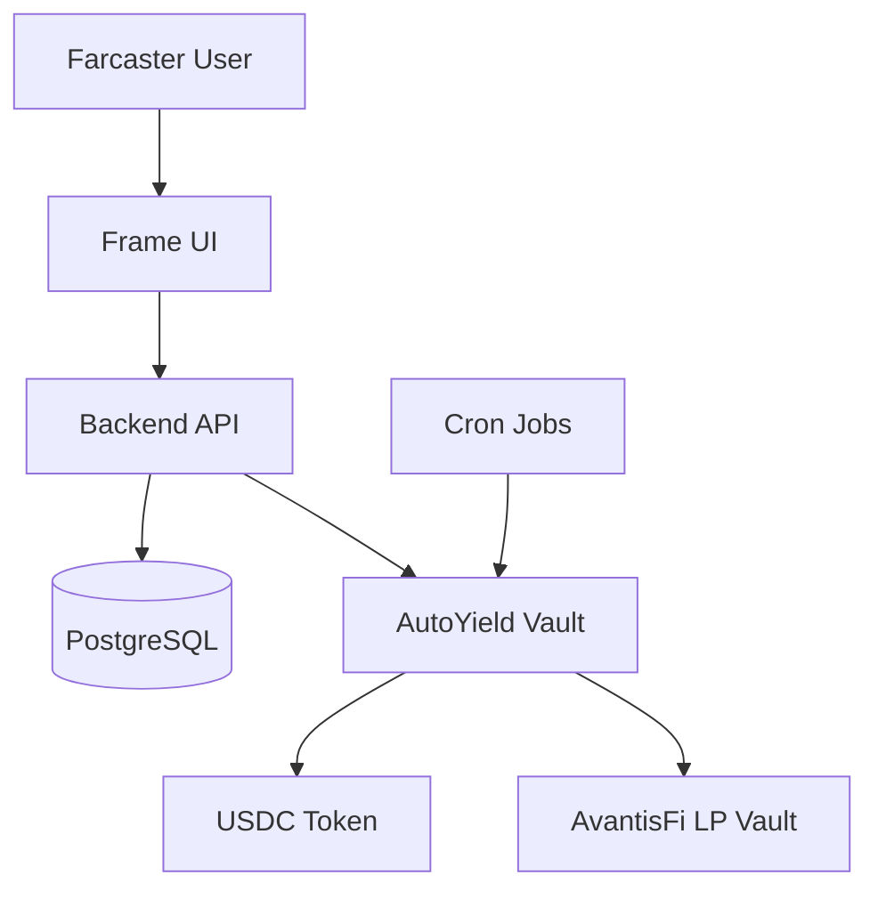

# AutoYield - Automated DeFi Savings on Base

A Farcaster Frame v2 mini-app that enables automated daily USDC deductions from user wallets, pooling funds, and deploying them into AvantisFi yield strategies.

## 🌟 Features

- **Gasless Subscriptions**: Users subscribe via EIP-2612 permits (no gas required)
- **Automated Daily Deductions**: Backend relayer executes daily USDC deductions
- **Direct AvantisFi Integration**: Immediate deposit into AvantisFi LP Vault (avUSDC)
- **Farcaster Frame UI**: Full-screen user experience within Farcaster
- **Real-time Yield Tracking**: Monitor earnings and APY
- **Batch Processing**: Gas-optimized batch deductions
- **Comprehensive Monitoring**: Relayer health, vault monitoring, yield snapshots

## 📁 Project Structure

```
autoyield/
├── contracts/              # Smart contracts (Solidity)
│   ├── AutoYieldVault.sol
│   ├── AutoYieldFactory.sol
│   └── mocks/
├── backend/                # Backend services (Node.js)
│   ├── src/
│   │   ├── services/      # Core business logic
│   │   ├── routes/        # API & Frame endpoints
│   │   ├── cron/          # Scheduled jobs
│   │   └── utils/         # Utilities
│   └── prisma/            # Database schema
├── test/                   # Smart contract tests
└── scripts/                # Deployment scripts
```

## 🚀 Quick Start

### Prerequisites

- Node.js v18+
- PostgreSQL database
- Base wallet with ETH for gas (operator/relayer)
- Farcaster account

### 1. Clone and Install

```bash
git clone <repository-url>
cd autoyield

# Install contract dependencies
npm install

# Install backend dependencies
cd backend
npm install
```

### 2. Environment Setup

**Root `.env`:**
```bash
cp .env.example .env
# Edit .env with your Base RPC, private key, etc.
```

**Backend `.env`:**
```bash
cd backend
cp .env.example .env
# Edit with database URL, vault address, operator key
```

### 3. Deploy Smart Contracts

```bash
# Compile contracts
npm run compile

# Deploy to Base Sepolia testnet
npm run deploy:sepolia

# Or deploy mocks for local testing
npx hardhat node  # In terminal 1
npm run deploy:mocks  # In terminal 2
```

### 4. Setup Database

```bash
cd backend

# Generate Prisma client
npm run db:generate

# Run migrations
npm run db:migrate

# (Optional) Open Prisma Studio
npm run db:studio
```

### 5. Start Backend

```bash
cd backend

# Development mode (with auto-reload)
npm run dev

# Production mode
npm start
```

The backend will be available at `http://localhost:3000`

## 🧪 Testing

### Smart Contract Tests

```bash
# Run all tests
npm test

# Run with coverage
npm run test:coverage
```

### Backend Tests

```bash
cd backend
npm test
```

## 📊 API Endpoints

### Public API

- `GET /api/stats` - Platform statistics
- `GET /api/user/:address` - User profile and yield data
- `GET /api/yield/history` - Historical yield data
- `GET /api/subscription/:address` - Subscription details
- `GET /api/transactions/:address` - Transaction history
- `POST /api/sync-user` - Sync user from blockchain

### Farcaster Frame

- `GET /frame` - Initial frame (hero)
- `POST /frame/onboard` - Onboarding flow
- `POST /frame/subscribe` - Subscription creation
- `POST /frame/dashboard` - User dashboard
- `POST /frame/withdraw` - Withdrawal flow

## 🔄 Cron Jobs

The backend runs several automated jobs:

| Job | Schedule | Description |
|-----|----------|-------------|
| Daily Deductions | `0 0 * * *` | Execute deductions for all eligible users |
| Relayer Balance Check | `0 */6 * * *` | Monitor operator wallet ETH balance |
| Yield Snapshot | `0 */4 * * *` | Record vault performance metrics |
| Vault Health Check | `0 * * * *` | Monitor AvantisFi vault status |

## 🏗️ Architecture



## 🔐 Security

### Smart Contracts

- ✅ ReentrancyGuard on all state-changing functions
- ✅ Access control (OPERATOR_ROLE, ADMIN_ROLE)
- ✅ Pausable mechanism for emergencies
- ✅ EIP-2612 permit validation
- ✅ Comprehensive test coverage

### Backend

- ✅ Private key management via environment variables
- ✅ Database connection pooling
- ✅ Rate limiting (TODO)
- ✅ Input validation
- ✅ Error handling and logging

## 📈 Monitoring & Alerts

### Automated Monitoring

- **Relayer Balance**: Alerts when ETH balance < 0.1 ETH
- **Vault Health**: Alerts on >20% TVL drops
- **APY Anomalies**: Alerts if APY outside 0-50% range
- **Transaction Failures**: Logs and records all failed deductions

### Metrics Tracked

- Total users & active subscriptions
- Daily deduction success rate
- Total value locked in AvantisFi
- Current APY
- Gas costs per deduction
- Relayer wallet balance

## 🛠️ Smart Contract Addresses

### Base Mainnet

- **AutoYieldVault**: `TBD`
- **AutoYieldFactory**: `TBD`
- **USDC**: `0x833589fCD6eDb6E08f4c7C32D4f71b54bdA02913`
- **AvantisFi LP Vault**: `TBD`

### Base Sepolia Testnet

- **AutoYieldVault**: `TBD`
- **Mock USDC**: `0x036CbD53842c5426634e7929541eC2318f3dCF7e`

## 🤝 Contributing

Contributions are welcome! Please follow these steps:

1. Fork the repository
2. Create a feature branch (`git checkout -b feature/amazing-feature`)
3. Commit your changes (`git commit -m 'Add amazing feature'`)
4. Push to the branch (`git push origin feature/amazing-feature`)
5. Open a Pull Request

## 📝 License

MIT License - see LICENSE file for details

## 🔗 Links

- **Farcaster Frames Documentation**: https://docs.farcaster.xyz/developers/frames/v2/
- **Base Network**: https://base.org
- **AvantisFi Protocol**: https://avantisfi.com

## ⚠️ Disclaimer

This software is provided "as is" without warranty. Use at your own risk. Always conduct thorough security audits before deploying to mainnet with real funds.

## 📞 Support

For issues and questions:
- Open a GitHub issue
- Join our Discord: [TBD]
- Twitter: [TBD]
